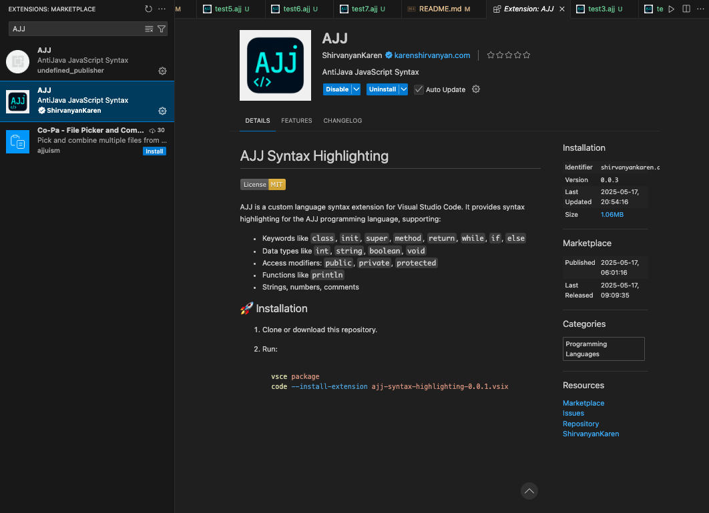

# AJJ Language Documentation

## Introduction

AJJ (also called AJJScript) is a statically typed, object-oriented programming language with a Java-like syntax, designed as an educational tool for learning compiler construction. AJJ compiles to JavaScript and includes a subset of object-oriented programming features such as classes, inheritance, access control, and method overriding. While its core is intentionally simple to keep the compiler implementation tractable, AJJ includes enough features to express non-trivial programs in a structured and readable style.

AJJ allows top-level functions and statements alongside classes, which makes it flexible enough for both quick scripts and more organized, class-based applications. Developers can write procedural code, class-heavy hierarchies, or mix both in the same file.

---

## Why AJJ? Why This Language Design?

AJJ was created for educational purposes—to learn how to build a compiler from scratch. Designing the language provided a hands-on way to implement lexical analysis, parsing, type checking, and code generation. The language’s syntax and semantics were inspired by Java and JavaScript, striking a balance between familiarity and teachability.

### Language Goals

* **Educational Focus**: AJJ serves as a practical guide to compiler construction.
* **Simplicity with Structure**: The language includes essential object-oriented features while omitting complexity such as generics, floating point arithmetic, and exception handling.
* **JavaScript as Target**: JavaScript's ubiquity made it a natural compilation target. This allows AJJ code to run anywhere JavaScript does, with a simple translation layer.

### Intended Use Cases

* Teaching compiler design, parsing, and type checking
* Demonstrating object-oriented principles
* Writing structured, class-based programs for learning purposes
* Exploring language design tradeoffs

---

## Language Features

### 1. Class-Based Object-Oriented Programming

```ajj
class Person {
  string name;
  int age;

  init(string name, int age) {
    this.name = name;
    this.age = age;
  }

  method getInfo() string {
    return this.name + " is " + this.age;
  }
}
```

### 2. Inheritance and Super Calls

```ajj
class Student extends Person {
  string studentId;

  init(string name, int age, string studentId) {
    super(name, age);
    this.studentId = studentId;
  }

  method getInfo() string {
    return super.getInfo() + " (ID: " + this.studentId + ")";
  }
}
```

### 3. Access Modifiers

```ajj
class Demo {
  private int secret;
  protected int halfSecret;
  public int open;
}
```

### 4. Top-Level Code & Functions

```ajj
method greet(string name) void {
  println("Hello, " + name);
}

greet("World");
```

### 5. Control Flow

```ajj
if (x > 0) {
  println("Positive");
} else {
  println("Negative");
}

while (x < 10) {
  println(x);
  x = x + 1;
}
```

### 6. Ternary Operator

```js
int score = 85;
string grade = score > 60 ? "Pass" : "Fail";
```

### 7. For Loops

```js
for (int i = 0; i < 5; i++) {
  println(i);
}
```

### 8. Method Overloading

```js
method add(int a, int b) int {
  return a + b;
}

method add(string a, string b) string {
  return a + b;
}
```

### 9. Static Typing & Type Checking

```js
int x = 10;
string s = "Age: " + x; // Valid
x = "hello"; // Type Error
```

### 10. Subtyping Rules

```js
Person p = new Student("Alice", 20, "S123"); // ✅ Allowed
Student s = new Person("Bob", 30); // ❌ Type Error
```

---

## Known Limitations

1. **No Collections**: No arrays, lists, maps, or sets are implemented yet.
2. **No Floating Point**: Only integer arithmetic is supported.
3. **Limited String Operations**: Strings can only be concatenated.
4. **No Exception Handling**: try/catch is not implemented.
5. **No Constants or Final Variables**: `const` and `final` are not supported.
6. **No Interfaces or Abstract Classes**: All classes are concrete.
7. **No Import/Export or Modules**: Everything must be defined in the same file.

---

## Lessons Learned / What We'd Do Differently

* **Type System**: A more expressive type system with type inference could enhance the developer experience.
* **Collections**: Adding support for basic data structures would significantly increase the language’s practicality.
* **Standard Library**: Even a small standard library for math, strings, and collections would make AJJ more usable.
* **Error Messages**: Compiler error messages could be improved for clarity.
* **Modules and Imports**: A module system would allow for larger and more maintainable projects.
* **Constructor Inheritance**: Supporting implicit inheritance of constructors would simplify class design.

If the project were restarted, we might:

* Use TypeScript for both compiler and runtime typing.
* Consider targeting WebAssembly or Python for broader runtime options.
* Introduce a REPL for interactive debugging.

---

## How to Use AJJ from the Terminal (CLI Setup)

### 1. Add AJJ Syntax Highlighting to VS Code

Search the Visual Studio Code Extension Marketplace for `AJJScript Syntax` and install the matching extension (see image below for reference).


### 2. Make the CLI Executable Globally

If your `ajj` entry file looks like this:

```js
#!/usr/bin/env node

const fs = require("fs");
const path = require("path");
const compileAndRun = require("./src/compiler.js");

const filename = process.argv[2];

if (!filename) {
  console.error("Usage: ajj <filename>");
  process.exit(1);
}

const filePath = path.resolve(process.cwd(), filename);
compileAndRun(filePath);
```

Then follow these steps:

```bash
# 1. Make the CLI script executable
chmod +x ajj.js

# 2. Link it globally using npm
npm link
```

This allows you to run AJJ files globally:

```bash
ajj path/to/script.ajj
```

### 3. Alternative: Run Directly with Node

If you don't want to use `ajj <filename>`, you can run your script directly with Node:

```bash
node src/compiler.js ajj path/to/script.ajj
```

---

## Compilation Instructions

### Setup

```bash
# Clone the repository
git clone https://github.com/yourusername/ajjscript.git
cd ajjscript

# Install dependencies
npm install
```

### Running the Compiler

```bash
# Compile an AJJ file to JavaScript
node src/index.js path/to/file.ajj

# Compile and run in one step
node src/index.js path/to/file.ajj --run
```

### Running Tests

```bash
npm test
```

---

## Formal Syntax Definition (BNF-like)

```text
program         → classDef* statement*
classDef        → "class" IDENTIFIER ("extends" IDENTIFIER)? "{" classBody "}"
classBody       → varDec* constructor? method*
varDec          → access? type IDENTIFIER ";"
constructor     → "init" "(" paramList? ")" (":" "super" "(" argList ")")? block
method          → access? "method" IDENTIFIER "(" paramList? ")" returnType block
paramList       → param ("," param)*
param           → type IDENTIFIER
returnType      → type | "void"
type            → "int" | "string" | "boolean" | IDENTIFIER
block           → "{" statement* "}"
statement       → exprStmt | ifStmt | whileStmt | forStmt | returnStmt | breakStmt | block | varDecStmt | printStmt
exprStmt        → expression ";"
ifStmt          → "if" "(" expression ")" statement ("else" statement)?
whileStmt       → "while" "(" expression ")" statement
forStmt         → "for" "(" statement expression ";" statement ")" statement
returnStmt      → "return" expression? ";"
breakStmt       → "break" ";"
varDecStmt      → type IDENTIFIER ("=" expression)? ";"
printStmt       → "println" "(" expression ")" ";"
expression      → assignment
assignment      → (call ".")? IDENTIFIER "=" assignment | logicOr
logicOr         → logicAnd ("||" logicAnd)*
logicAnd        → equality ("&&" equality)*
equality        → comparison (("==" | "!=" ) comparison)*
comparison      → term ((">" | ">=" | "<" | "<=" ) term)*
term            → factor (("+" | "-") factor)*
factor          → unary (("*" | "/") unary)*
unary           → ("!" | "-") unary | primary
primary         → "true" | "false" | NUMBER | STRING | "this" | IDENTIFIER | "(" expression ")" | "new" IDENTIFIER "(" argList? ")" | call
call            → primary ("." IDENTIFIER "(" argList? ")")*
argList         → expression ("," expression)*
```

---

## Conclusion

AJJ is a minimalist, statically typed language with clear syntax and basic object-oriented features. Its purpose is educational—offering a sandbox to learn about compilers, parsing, type systems, and language design tradeoffs. While limited in scope, AJJ provides a functional and expressive syntax that encourages good coding structure and provides opportunities to explore deeper compiler features.

Instructors, students, and hobbyists alike may find AJJ a compelling platform for understanding what goes into building a programming language—and the many design choices that come along the way.

---

## License

This project is licensed under the MIT License.


